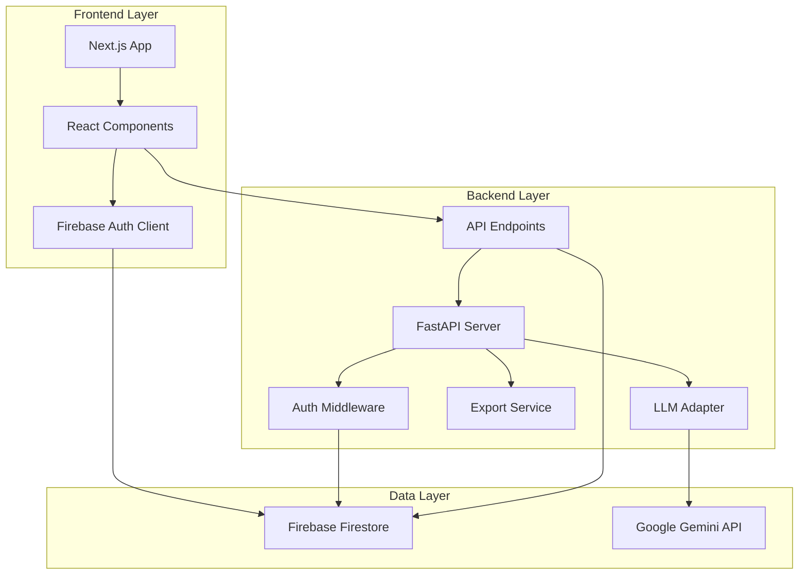
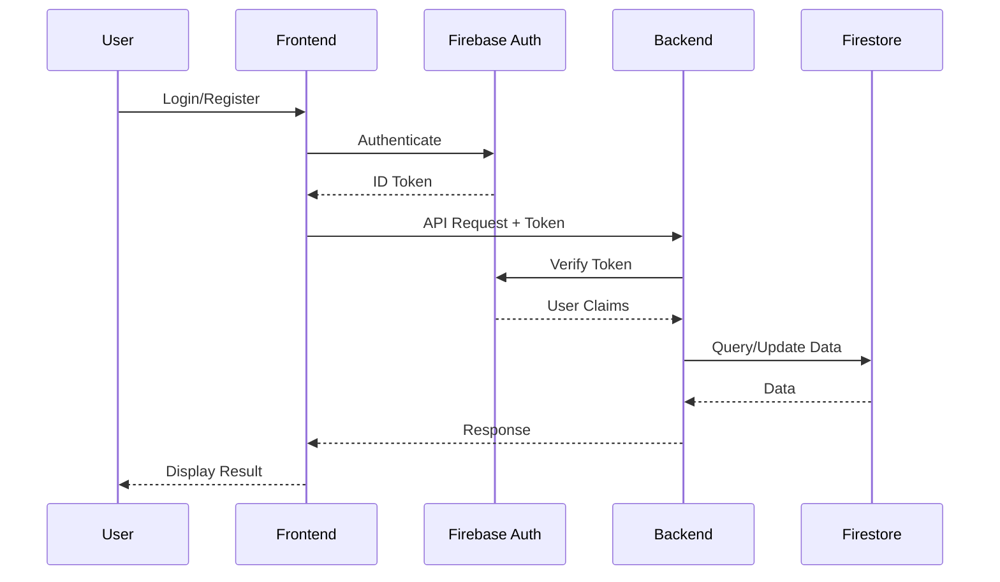
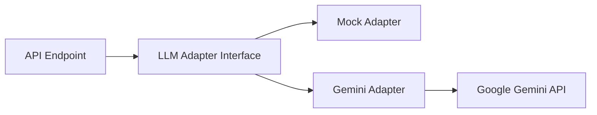
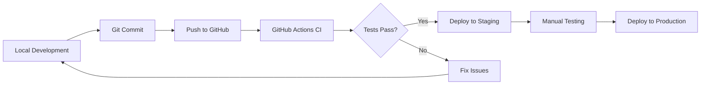

# Architecture Overview

This document provides a comprehensive overview of the AI Document Authoring App architecture, including system design, technology stack, data models, and key components.

## System Overview

The DocBuilder application is a full-stack web application that leverages AI to assist users in creating professional documents and presentations. The system follows a modern three-tier architecture:



## Technology Stack

### Frontend
| Technology | Version | Purpose |
|------------|---------|---------|
| **Next.js** | 13.4.4 | React framework with SSR and routing |
| **React** | 18.2.0 | UI component library |
| **TypeScript** | 5.0.4 | Type-safe JavaScript |
| **TailwindCSS** | 3.3.2 | Utility-first CSS framework |
| **Firebase SDK** | 9.22.0 | Authentication and Firestore client |
| **Axios** | 1.4.0 | HTTP client for API calls |

### Backend
| Technology | Version | Purpose |
|------------|---------|---------|
| **FastAPI** | Latest | Modern Python web framework |
| **Python** | 3.9+ | Programming language |
| **Firebase Admin SDK** | Latest | Server-side Firebase integration |
| **Google Generative AI** | Latest | Gemini LLM integration |
| **python-docx** | Latest | DOCX file generation |
| **python-pptx** | Latest | PPTX file generation |
| **Pydantic** | Latest | Data validation and models |

### Infrastructure
- **Database**: Firebase Firestore (NoSQL document database)
- **Authentication**: Firebase Authentication
- **AI**: Google Gemini Pro
- **CI/CD**: GitHub Actions
- **Deployment**: Vercel (Frontend), Cloud Run/Render/Railway (Backend)

## Data Models

### Project Model

```python
class Project(BaseModel):
    id: str                                    # Unique project identifier
    owner_uid: str                             # Firebase user ID
    title: str                                 # Project title
    doc_type: str                              # "docx" or "pptx"
    outline: List[Section]                     # Document sections
    slides: List[Any]                          # For PPTX compatibility
    generation_history: List[GenerationHistoryItem]  # LLM interaction history
    created_at: datetime                       # Creation timestamp
    updated_at: datetime                       # Last update timestamp
```

### Section Model

```python
class Section(BaseModel):
    id: str                                    # Unique section identifier
    title: str                                 # Section title
    word_count: int                            # Target word count
    content: Optional[str]                     # Generated content
    bullets: Optional[List[str]]               # Bullet points summary
    status: str                                # "queued", "generating", "done", "failed"
    refinement_history: List[Refinement]       # Refinement iterations
    comments: List[Comment]                    # User comments
    version: int                               # Content version number
```

### Refinement Model

```python
class Refinement(BaseModel):
    id: str                                    # Unique refinement identifier
    user_id: str                               # User who requested refinement
    prompt: str                                # Refinement instructions
    raw_response: Optional[str]                # Raw LLM response
    parsed_text: Optional[str]                 # Parsed content
    diff_summary: Optional[str]                # Summary of changes
    created_at: datetime                       # Creation timestamp
    likes: List[str]                           # User IDs who liked
    dislikes: List[str]                        # User IDs who disliked
```

### Comment Model

```python
class Comment(BaseModel):
    id: str                                    # Unique comment identifier
    user_id: str                               # Commenter user ID
    text: str                                  # Comment text
    created_at: datetime                       # Creation timestamp
```

## Authentication Flow



### Authentication Implementation

1. **Frontend**: Uses Firebase Authentication SDK for login/register
2. **Token Generation**: Firebase generates JWT ID tokens
3. **Token Transmission**: Frontend sends token in `Authorization: Bearer <token>` header
4. **Backend Verification**: FastAPI middleware verifies token using Firebase Admin SDK
5. **User Context**: Decoded token provides user ID and claims for authorization

## LLM Integration Architecture

### Adapter Pattern

The application uses an adapter pattern for LLM integration, allowing easy switching between providers:



### LLM Adapters

#### MockLLMAdapter
- **Purpose**: Development and testing
- **Behavior**: Returns deterministic mock responses
- **Usage**: Set `LLM_PROVIDER=mock` in environment

#### GeminiLLMAdapter
- **Purpose**: Production AI generation
- **Model**: `gemini-pro`
- **Features**: JSON-structured prompts, retry logic, error handling
- **Usage**: Set `LLM_PROVIDER=gemini` and provide `GOOGLE_API_KEY`

### LLM Operations

| Operation | Endpoint | LLM Method | Purpose |
|-----------|----------|------------|---------|
| **Outline Generation** | `POST /projects/{id}/suggest-outline` | `generate_outline()` | Generate document structure |
| **Content Generation** | `POST /projects/{id}/generate` | `generate_section()` | Generate section content |
| **Content Refinement** | `POST /projects/{id}/sections/{sid}/refine` | `refine_section()` | Refine existing content |

## API Architecture

### RESTful Design

The backend follows RESTful principles:

- **Resource-based URLs**: `/projects`, `/projects/{id}`
- **HTTP Methods**: GET, POST, PUT, DELETE
- **Status Codes**: 200 (OK), 201 (Created), 404 (Not Found), 401 (Unauthorized)
- **JSON Payloads**: All requests and responses use JSON

### Endpoint Organization

```
/health                                    # Health check
/projects                                  # List/Create projects
/projects/{id}                             # Get/Update/Delete project
/projects/{id}/suggest-outline             # Generate outline
/projects/{id}/generate                    # Generate content
/projects/{id}/sections/{sid}/refine       # Refine content
/projects/{id}/sections/{sid}/comments     # Add comment
/projects/{id}/sections/{sid}/refinements/{rid}/like    # Like refinement
/projects/{id}/sections/{sid}/refinements/{rid}/dislike # Dislike refinement
/projects/{id}/export                      # Export document
```

## Export Service Architecture

### Document Generation

The export service generates documents in two formats:

#### DOCX Generation
1. Creates `python-docx` Document object
2. Adds title page with project metadata
3. Iterates through sections, adding headings and content
4. Converts markdown content to plain text
5. Adds bullet points with proper styling
6. Returns BytesIO stream for download

#### PPTX Generation
1. Creates `python-pptx` Presentation object
2. Adds title slide with project name
3. Creates content slides for each section
4. Adds bullet points (max 4 per slide)
5. Includes full content in slide notes
6. Returns BytesIO stream for download

## Database Schema (Firestore)

### Collections

#### `projects` Collection
```
projects/
  {project_id}/
    - id: string
    - owner_uid: string
    - title: string
    - doc_type: string
    - outline: array
    - generation_history: array
    - created_at: timestamp
    - updated_at: timestamp
```

### Data Access Patterns

1. **List Projects**: Query `projects` where `owner_uid == current_user.uid`
2. **Get Project**: Direct document read by `project_id`
3. **Update Project**: Partial update with `updated_at` timestamp
4. **Delete Project**: Document deletion by `project_id`

## Security Architecture

### Authentication & Authorization

- **Authentication**: Firebase ID tokens (JWT)
- **Authorization**: User ID from token matched against `owner_uid`
- **CORS**: Configured for specific origins
- **Token Verification**: Every API request validates token

### Security Best Practices

1. **No API Keys in Frontend**: All LLM calls from backend only
2. **User Isolation**: Users can only access their own projects
3. **Input Validation**: Pydantic models validate all inputs
4. **Environment Variables**: Sensitive data in `.env` files
5. **HTTPS**: Required for production deployments

## Scalability Considerations

### Current Architecture
- **Stateless Backend**: Horizontal scaling possible
- **Firestore**: Auto-scaling NoSQL database
- **Serverless Options**: Compatible with Cloud Run, Lambda

### Performance Optimizations
- **Async Operations**: FastAPI async endpoints
- **Connection Pooling**: Firebase Admin SDK connection reuse
- **Caching**: Browser caching for static assets
- **CDN**: Vercel CDN for frontend assets

## Development Workflow



## Monitoring & Logging

### Backend Logging
- **Framework**: Python `logging` module
- **Levels**: INFO, WARNING, ERROR
- **Output**: Console (development), File (production)

### Error Tracking
- **LLM Errors**: Logged with full prompt and response
- **Auth Errors**: Logged with sanitized token info
- **Database Errors**: Logged with operation details

---

[← Back to Documentation Home](README.md) | [Next: Features Overview →](features/README.md)
