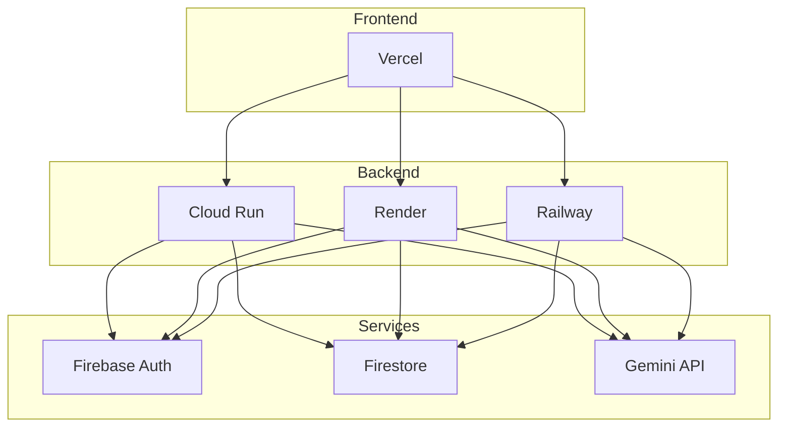

# Deployment Overview

Overview of deployment options and recommendations for the DocBuilder application.

## Deployment Architecture



## Recommended Platforms

### Frontend: Vercel

**Why Vercel:**
- ✅ Built for Next.js (same company)
- ✅ Automatic deployments from Git
- ✅ Free tier includes SSL, CDN
- ✅ Environment variable management
- ✅ Preview deployments for PRs

**Alternatives:**
- Netlify
- AWS Amplify
- GitHub Pages (static export only)

### Backend: Cloud Run / Render / Railway

**Cloud Run (Google Cloud):**
- ✅ Serverless, auto-scaling
- ✅ Pay per use
- ✅ Integrated with Google services
- ❌ Requires Google Cloud account
- ❌ More complex setup

**Render:**
- ✅ Simple deployment
- ✅ Free tier available
- ✅ Automatic SSL
- ✅ Easy environment variables
- ❌ Cold starts on free tier

**Railway:**
- ✅ Very simple deployment
- ✅ GitHub integration
- ✅ Good free tier
- ✅ Built-in monitoring
- ❌ Newer platform

## Deployment Checklist

### Pre-Deployment

- [ ] All tests passing locally
- [ ] Environment variables documented
- [ ] Firebase project created for production
- [ ] Google Cloud API key obtained
- [ ] Database security rules configured
- [ ] CORS configured for production domain

### Frontend Deployment

- [ ] Push code to GitHub
- [ ] Connect repository to Vercel
- [ ] Configure environment variables
- [ ] Deploy and test
- [ ] Configure custom domain (optional)

### Backend Deployment

- [ ] Choose deployment platform
- [ ] Configure build command
- [ ] Configure start command
- [ ] Set environment variables
- [ ] Deploy and test
- [ ] Update frontend API URL

### Post-Deployment

- [ ] Test authentication flow
- [ ] Test project creation
- [ ] Test AI generation
- [ ] Test export functionality
- [ ] Monitor logs for errors
- [ ] Set up monitoring/alerts

## Environment Variables

### Frontend (Vercel)

```env
NEXT_PUBLIC_API_URL=https://your-backend.onrender.com
NEXT_PUBLIC_FIREBASE_API_KEY=...
NEXT_PUBLIC_FIREBASE_AUTH_DOMAIN=...
NEXT_PUBLIC_FIREBASE_PROJECT_ID=...
NEXT_PUBLIC_FIREBASE_STORAGE_BUCKET=...
NEXT_PUBLIC_FIREBASE_MESSAGING_SENDER_ID=...
NEXT_PUBLIC_FIREBASE_APP_ID=...
```

### Backend (Cloud Run/Render/Railway)

```env
GOOGLE_API_KEY=your_gemini_api_key
LLM_PROVIDER=gemini
FIREBASE_CREDENTIALS=<JSON string or file path>
PORT=8000
```

## CI/CD Pipeline

### GitHub Actions (Included)

The project includes a CI/CD workflow in `.github/workflows/ci.yml`:

**Features:**
- Runs on push to `main` branch
- Tests backend with pytest
- Tests frontend with npm
- Runs on pull requests

**Workflow:**
```yaml
name: CI

on:
  push:
    branches: [ main ]
  pull_request:
    branches: [ main ]

jobs:
  backend-test:
    runs-on: ubuntu-latest
    steps:
      - Checkout code
      - Set up Python
      - Install dependencies
      - Run pytest

  frontend-test:
    runs-on: ubuntu-latest
    steps:
      - Checkout code
      - Set up Node.js
      - Install dependencies
      - Run tests (when configured)
```

## Monitoring

### Application Monitoring

**Backend:**
- Use platform logs (Cloud Run, Render, Railway)
- Monitor API response times
- Track error rates

**Frontend:**
- Vercel Analytics (built-in)
- Google Analytics (optional)
- Error tracking (Sentry, optional)

### Database Monitoring

**Firestore:**
- Firebase Console → Usage tab
- Monitor read/write operations
- Check storage usage
- Review security rule violations

### API Monitoring

**Gemini API:**
- Google Cloud Console → APIs & Services
- Monitor quota usage
- Track request counts
- Review error rates

## Scaling Considerations

### Frontend Scaling

Vercel handles scaling automatically:
- CDN caching
- Edge network
- Automatic scaling

### Backend Scaling

**Cloud Run:**
- Auto-scales based on traffic
- Configure min/max instances
- Set concurrency limits

**Render/Railway:**
- Vertical scaling (upgrade plan)
- Horizontal scaling (multiple instances)

### Database Scaling

**Firestore:**
- Automatically scales
- Monitor quota limits
- Optimize queries
- Use indexes

## Cost Estimates

### Free Tier (Development/Small Projects)

- **Vercel**: Free (hobby plan)
- **Render**: Free (with limitations)
- **Railway**: $5/month credit
- **Firebase**: Free tier (generous limits)
- **Gemini API**: Free tier (60 req/min)

**Total**: $0-5/month

### Production (Medium Traffic)

- **Vercel**: $20/month (Pro plan)
- **Cloud Run**: $10-50/month (based on usage)
- **Firebase**: $25-100/month (Blaze plan)
- **Gemini API**: $20-100/month (based on usage)

**Total**: $75-270/month

## Security Best Practices

1. **Use HTTPS**: Always use SSL/TLS in production
2. **Environment Variables**: Never commit secrets
3. **API Keys**: Rotate regularly
4. **CORS**: Configure for specific domains only
5. **Rate Limiting**: Implement to prevent abuse
6. **Monitoring**: Set up alerts for suspicious activity

## Rollback Strategy

### Frontend (Vercel)

1. Go to Vercel Dashboard
2. Select deployment
3. Click "Promote to Production" on previous deployment

### Backend (Render/Railway)

1. Go to platform dashboard
2. Select previous deployment
3. Redeploy or rollback

### Database (Firestore)

- No built-in rollback
- Use Firestore export/import for backups
- Implement application-level versioning

## Next Steps

1. [Backend Deployment](backend-deployment.md) - Deploy backend to Cloud Run/Render/Railway
2. [Frontend Deployment](frontend-deployment.md) - Deploy frontend to Vercel
3. [Environment Variables](environment-variables.md) - Complete environment variable reference

---

[← Back to Documentation Home](../README.md) | [Next: Backend Deployment →](backend-deployment.md)
