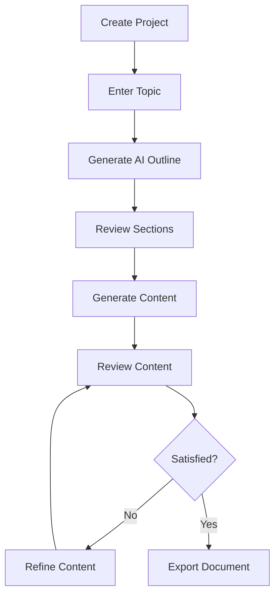
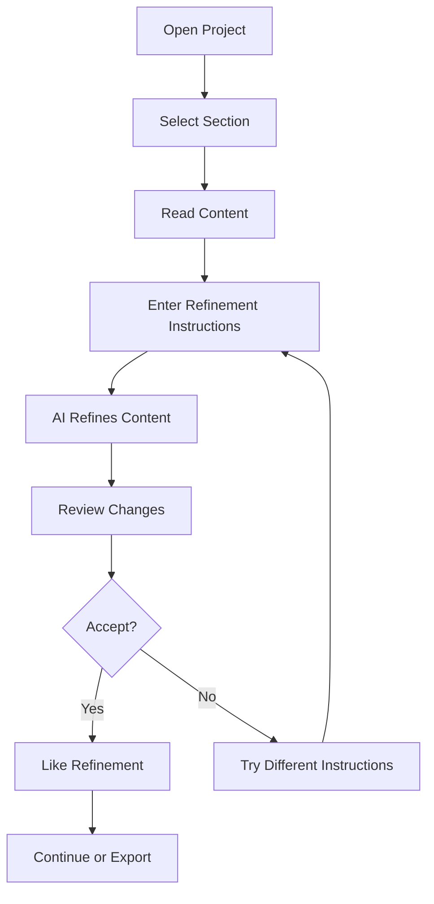

# Features Overview

The AI Document Authoring App provides a comprehensive suite of features for creating, refining, and exporting professional documents with AI assistance.

## Core Features

### 🔐 [Authentication](authentication.md)
Secure user authentication powered by Firebase, supporting multiple sign-in methods including email/password and Google OAuth.

**Key Capabilities:**
- User registration and login
- Session management
- Secure token-based API authentication

---

### 📁 [Project Management](project-management.md)
Create and manage multiple document projects with support for both DOCX and PPTX formats.

**Key Capabilities:**
- Create new projects (reports or presentations)
- List all user projects
- Update project details
- Delete projects
- Track creation and modification timestamps

---

### 🤖 [AI Outline Generation](ai-outline-generation.md)
Generate structured document outlines based on a topic using Google Gemini AI.

**Key Capabilities:**
- Topic-based outline suggestions
- Automatic section structure generation
- Recommended word counts per section
- Support for 5-8 sections per document

---

### ✨ [Content Generation](content-generation.md)
Generate professional content for each section using AI, with automatic retry logic and status tracking.

**Key Capabilities:**
- Section-by-section content generation
- Bullet point summaries
- Full paragraph content
- Generation status tracking (queued, generating, done, failed)
- Retry logic for failed generations

---

### 🔄 [Content Refinement](refinement.md)
Iteratively refine generated content with AI-powered suggestions and maintain version history.

**Key Capabilities:**
- Natural language refinement instructions
- Version history tracking
- Diff summaries showing changes
- Multiple refinement iterations
- Rollback to previous versions

---

### 💬 [Collaboration](collaboration.md)
Collaborate on documents with comments and reaction features.

**Key Capabilities:**
- Add comments to sections
- Like/dislike refinements
- User attribution for all interactions
- Timestamp tracking

---

### 📥 [Export](export.md)
Export completed projects to professional DOCX or PPTX formats.

**Key Capabilities:**
- DOCX export with proper formatting
- PPTX export with slides and speaker notes
- Markdown to formatted text conversion
- Downloadable files

---

## Feature Comparison Matrix

| Feature | DOCX Projects | PPTX Projects |
|---------|---------------|---------------|
| AI Outline Generation | ✅ | ✅ |
| Content Generation | ✅ | ✅ |
| Bullet Points | ✅ | ✅ |
| Full Content | ✅ | ✅ (in notes) |
| Refinement | ✅ | ✅ |
| Comments | ✅ | ✅ |
| Reactions | ✅ | ✅ |
| Export | ✅ DOCX | ✅ PPTX |

## User Workflows

### Creating a Document from Scratch

### Refining Existing Content

## Feature Details

### Authentication
- **Technology**: Firebase Authentication
- **Supported Methods**: Email/Password, Google OAuth
- **Security**: JWT tokens, secure session management
- [Learn more →](authentication.md)

### Project Management
- **Storage**: Firebase Firestore
- **Access Control**: User-based isolation
- **Data Model**: Projects with sections/slides
- [Learn more →](project-management.md)

### AI Outline Generation
- **AI Model**: Google Gemini Pro
- **Input**: Topic description
- **Output**: Structured outline with 5-8 sections
- **Customization**: Automatic word count recommendations
- [Learn more →](ai-outline-generation.md)

### Content Generation
- **AI Model**: Google Gemini Pro
- **Input**: Section title, topic, word count
- **Output**: Full content + bullet points
- **Retry Logic**: Automatic retry on failures
- [Learn more →](content-generation.md)

### Content Refinement
- **AI Model**: Google Gemini Pro
- **Input**: Current content + refinement instructions
- **Output**: Refined content + diff summary
- **History**: Full version history maintained
- [Learn more →](refinement.md)

### Collaboration
- **Comments**: Thread-based discussions per section
- **Reactions**: Like/dislike refinements
- **Attribution**: User IDs and timestamps
- [Learn more →](collaboration.md)

### Export
- **Formats**: DOCX, PPTX
- **Libraries**: python-docx, python-pptx
- **Features**: Proper formatting, metadata, styling
- [Learn more →](export.md)

## Upcoming Features

> [!NOTE]
> The following features are planned for future releases:

- **Real-time Collaboration**: Multiple users editing simultaneously
- **Templates**: Pre-built document templates
- **Custom Styling**: User-defined themes and styles
- **Version Control**: Git-like branching and merging
- **Team Workspaces**: Shared project spaces
- **Advanced Export**: PDF, HTML, Markdown formats
- **AI Models**: Support for additional LLM providers

## Feature Requests

Have an idea for a new feature? We'd love to hear it!

1. Check existing [GitHub Issues](https://github.com/yourusername/docbuilder/issues)
2. Create a new feature request issue
3. Describe the use case and expected behavior
4. Engage with the community discussion

---

[← Back to Documentation Home](../README.md) | [Next: Authentication →](authentication.md)
