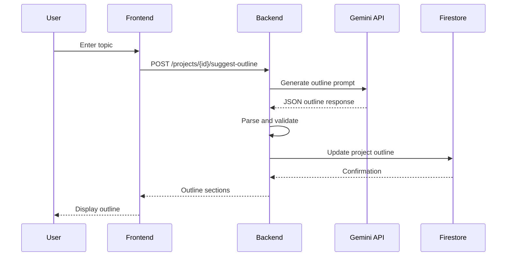

# AI Outline Generation

Generate structured document outlines automatically using Google Gemini AI based on a topic description.

## Overview

The AI Outline Generation feature helps users quickly create a structured outline for their document by simply providing a topic. The AI analyzes the topic and suggests 5-8 relevant sections with recommended word counts.

## How It Works



## API Endpoint

**Endpoint**: `POST /projects/{id}/suggest-outline`

**Request:**
```json
{
  "topic": "The impact of artificial intelligence on modern healthcare"
}
```

**Response:**
```json
{
  "outline": [
    {
      "id": "s1",
      "title": "Introduction to AI in Healthcare",
      "word_count": 150,
      "status": "queued",
      "content": null,
      "bullets": null,
      "refinement_history": [],
      "comments": [],
      "version": 1
    },
    {
      "id": "s2",
      "title": "Current Applications of AI",
      "word_count": 250,
      "status": "queued",
      ...
    },
    {
      "id": "s3",
      "title": "Benefits and Advantages",
      "word_count": 200,
      "status": "queued",
      ...
    },
    {
      "id": "s4",
      "title": "Challenges and Limitations",
      "word_count": 200,
      "status": "queued",
      ...
    },
    {
      "id": "s5",
      "title": "Future Outlook",
      "word_count": 150,
      "status": "queued",
      ...
    }
  ]
}
```

## LLM Implementation

### Prompt Engineering

The system uses a carefully crafted prompt to ensure consistent JSON output:

```python
prompt = f"""
SYSTEM: Return only JSON that adheres to the schema {{ "outline": [{{"id": "s1", "title": "...", "word_count": 150}}, ...] }}.
USER: For the topic: "{topic}", produce a business-report outline with 5-8 sections. Each section: id, title, and recommended word_count (50-400). Return only JSON, nothing else.
"""
```

**Key Prompt Elements:**
- **System instruction**: Specifies exact JSON schema
- **Topic injection**: User's topic inserted safely
- **Constraints**: 5-8 sections, word count range 50-400
- **Format requirement**: JSON only, no additional text

### Response Processing

```python
def generate_outline(self, topic: str) -> List[Dict[str, Any]]:
    raw_response = self._call_gemini(prompt)
    
    # Clean markdown code blocks if present
    cleaned_response = raw_response.replace("```json", "").replace("```", "").strip()
    
    try:
        data = json.loads(cleaned_response)
        return data.get("outline", [])
    except json.JSONDecodeError:
        raise ValueError(f"Invalid JSON from LLM: {raw_response}")
```

**Processing Steps:**
1. Call Gemini API with prompt
2. Remove markdown code block markers
3. Parse JSON response
4. Extract outline array
5. Validate structure

### Error Handling

**Invalid JSON Response:**
```python
try:
    data = json.loads(cleaned_response)
except json.JSONDecodeError:
    # Log error and retry or return error to user
    raise ValueError(f"Invalid JSON from LLM: {raw_response}")
```

**Missing Outline Key:**
```python
outline = data.get("outline", [])
if not outline:
    raise ValueError("No outline generated")
```

## Outline Structure

### Section Properties

Each generated section includes:

| Property | Type | Description | Example |
|----------|------|-------------|---------|
| `id` | string | Unique section identifier | "s1", "s2", "s3" |
| `title` | string | Section heading | "Introduction" |
| `word_count` | integer | Recommended word count | 150 |
| `status` | string | Generation status | "queued" |
| `content` | string\|null | Generated content | null (initially) |
| `bullets` | array\|null | Bullet points | null (initially) |
| `refinement_history` | array | Refinement versions | [] |
| `comments` | array | User comments | [] |
| `version` | integer | Content version | 1 |

### Typical Outline Patterns

**Business Report (5-7 sections):**
1. Executive Summary (100-150 words)
2. Introduction/Background (150-200 words)
3. Main Analysis/Body (200-300 words)
4. Key Findings/Results (200-250 words)
5. Recommendations (150-200 words)
6. Conclusion (100-150 words)

**Research Paper (6-8 sections):**
1. Abstract (100-150 words)
2. Introduction (200-250 words)
3. Literature Review (250-300 words)
4. Methodology (200-250 words)
5. Results (250-300 words)
6. Discussion (200-250 words)
7. Conclusion (150-200 words)
8. References (varies)

## Frontend Integration

### Outline Generation Component

```typescript
const OutlineGenerator = ({ projectId }: { projectId: string }) => {
  const [topic, setTopic] = useState('');
  const [loading, setLoading] = useState(false);
  
  const generateOutline = async () => {
    setLoading(true);
    try {
      const token = await auth.currentUser?.getIdToken();
      const response = await axios.post(
        `${API_URL}/projects/${projectId}/suggest-outline`,
        { topic },
        { headers: { Authorization: `Bearer ${token}` } }
      );
      
      // Update project with new outline
      setOutline(response.data.outline);
    } catch (error) {
      console.error('Failed to generate outline:', error);
    } finally {
      setLoading(false);
    }
  };
  
  return (
    <div>
      <input
        type="text"
        value={topic}
        onChange={(e) => setTopic(e.target.value)}
        placeholder="Enter your document topic..."
      />
      <button onClick={generateOutline} disabled={loading}>
        {loading ? 'Generating...' : 'Suggest Outline'}
      </button>
    </div>
  );
};
```

### Displaying the Outline

```typescript
const OutlineDisplay = ({ outline }: { outline: Section[] }) => {
  return (
    <div>
      <h2>Document Outline</h2>
      {outline.map((section, index) => (
        <div key={section.id}>
          <h3>{index + 1}. {section.title}</h3>
          <p>Target: {section.word_count} words</p>
          <button>Generate Content</button>
        </div>
      ))}
    </div>
  );
};
```

## Customization

### Modifying the Outline

After generation, users can:
1. **Edit section titles**: Update titles to be more specific
2. **Adjust word counts**: Change target word counts
3. **Add sections**: Manually add new sections
4. **Remove sections**: Delete unwanted sections
5. **Reorder sections**: Drag and drop to reorder

### Regenerating Outline

Users can regenerate the outline with a different topic:
- Previous outline is replaced
- Any generated content is preserved if section IDs match
- Confirmation prompt recommended before replacing

## Best Practices

### Topic Guidelines

**Good Topics:**
- ✅ "The impact of remote work on employee productivity"
- ✅ "Sustainable energy solutions for urban environments"
- ✅ "Digital transformation in the retail industry"

**Poor Topics:**
- ❌ "Write about stuff" (too vague)
- ❌ "AI" (too broad)
- ❌ "asdfghjkl" (nonsensical)

### Topic Tips

1. **Be specific**: Include key themes or focus areas
2. **Use complete phrases**: Full sentences work better than keywords
3. **Provide context**: Mention industry, audience, or purpose
4. **Avoid jargon**: Use clear, understandable language

### Outline Review

After generation:
1. **Review section titles**: Ensure they're relevant and clear
2. **Check word counts**: Adjust based on your needs
3. **Verify structure**: Ensure logical flow
4. **Add missing sections**: Include any important topics not covered

## Limitations

### Current Limitations

- **Fixed section count**: Always generates 5-8 sections
- **No custom templates**: Cannot specify preferred structure
- **Single language**: English only (Gemini supports others but not configured)
- **No section descriptions**: Only titles and word counts

### Future Enhancements

- Custom section count specification
- Template-based outlines (e.g., "Research Paper", "Business Proposal")
- Multi-language support
- Section descriptions and guidance
- Outline refinement (modify existing outline with AI)

## Troubleshooting

### Outline Generation Fails

**Symptom**: Error message or empty outline

**Possible Causes:**
- Invalid API key
- Gemini API rate limit exceeded
- Network connectivity issues
- Invalid JSON response from LLM

**Solutions:**
1. Check `GOOGLE_API_KEY` in backend `.env`
2. Wait a few minutes and retry
3. Check backend logs for detailed error
4. Try with mock LLM adapter for testing

### Irrelevant Sections Generated

**Symptom**: Sections don't match topic

**Solutions:**
1. Refine topic description to be more specific
2. Regenerate outline
3. Manually edit section titles
4. Provide more context in topic

## Related Documentation

- [Content Generation](content-generation.md)
- [LLM Architecture](../architecture.md#llm-integration-architecture)
- [API: Outline Endpoint](../api/outline.md)

---

[← Back to Features](README.md) | [Next: Content Generation →](content-generation.md)
