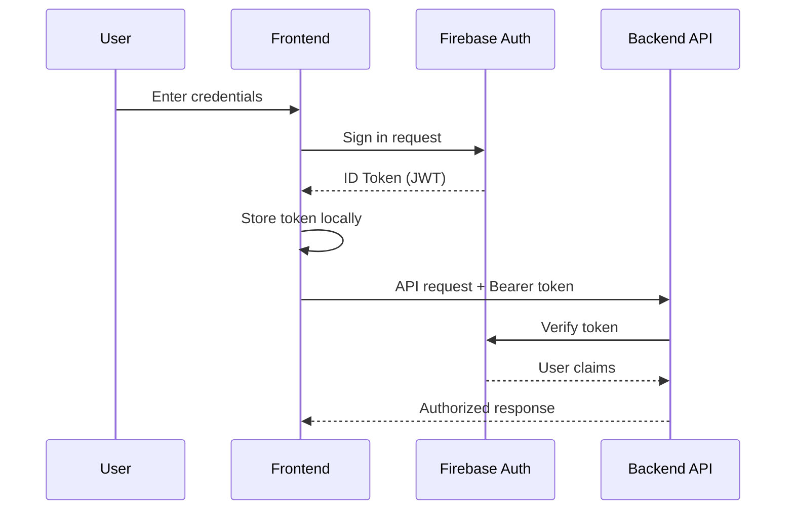

# Authentication

The DocBuilder application uses Firebase Authentication to provide secure user authentication and session management.

## Overview

Firebase Authentication handles all aspects of user authentication, including:
- User registration and login
- Session management with JWT tokens
- Secure API authentication
- Multiple authentication providers

## Supported Authentication Methods

### Email/Password Authentication
Users can register and sign in using their email address and password.

**Registration Flow:**
1. User provides email and password
2. Firebase creates user account
3. Verification email sent (optional)
4. User can sign in

**Login Flow:**
1. User provides credentials
2. Firebase validates credentials
3. ID token generated
4. User session established

### Google OAuth
Users can sign in using their Google account for a seamless experience.

**OAuth Flow:**
1. User clicks "Sign in with Google"
2. Google OAuth popup appears
3. User authorizes application
4. Firebase creates/links account
5. ID token generated

## Authentication Flow



## Implementation Details

### Frontend Implementation

The frontend uses the Firebase JavaScript SDK for authentication:

```typescript
// Firebase configuration
import { initializeApp } from 'firebase/app';
import { getAuth } from 'firebase/auth';

const firebaseConfig = {
  apiKey: process.env.NEXT_PUBLIC_FIREBASE_API_KEY,
  authDomain: process.env.NEXT_PUBLIC_FIREBASE_AUTH_DOMAIN,
  projectId: process.env.NEXT_PUBLIC_FIREBASE_PROJECT_ID,
  // ... other config
};

const app = initializeApp(firebaseConfig);
export const auth = getAuth(app);
```

**Login Example:**
```typescript
import { signInWithEmailAndPassword } from 'firebase/auth';

const login = async (email: string, password: string) => {
  try {
    const userCredential = await signInWithEmailAndPassword(auth, email, password);
    const token = await userCredential.user.getIdToken();
    // Store token for API calls
    return token;
  } catch (error) {
    console.error('Login failed:', error);
    throw error;
  }
};
```

**Registration Example:**
```typescript
import { createUserWithEmailAndPassword } from 'firebase/auth';

const register = async (email: string, password: string) => {
  try {
    const userCredential = await createUserWithEmailAndPassword(auth, email, password);
    const token = await userCredential.user.getIdToken();
    return token;
  } catch (error) {
    console.error('Registration failed:', error);
    throw error;
  }
};
```

### Backend Implementation

The backend uses Firebase Admin SDK to verify tokens:

**File**: `backend/app/core/auth.py`

```python
from fastapi import Depends, HTTPException, status
from fastapi.security import HTTPBearer, HTTPAuthorizationCredentials
from firebase_admin import auth

security = HTTPBearer()

async def get_current_user(credentials: HTTPAuthorizationCredentials = Depends(security)):
    token = credentials.credentials
    try:
        # Verify the Firebase ID token
        decoded_token = auth.verify_id_token(token)
        return decoded_token
    except Exception as e:
        raise HTTPException(
            status_code=status.HTTP_401_UNAUTHORIZED,
            detail=f"Invalid authentication credentials: {str(e)}",
            headers={"WWW-Authenticate": "Bearer"},
        )
```

**Usage in Endpoints:**
```python
@router.get("/projects")
async def list_projects(current_user: dict = Depends(get_current_user)):
    user_id = current_user['uid']
    # Fetch projects for this user
    ...
```

## Token Management

### ID Token Structure

Firebase ID tokens are JWT tokens containing:
- **User ID** (`uid`): Unique user identifier
- **Email**: User's email address
- **Issued At** (`iat`): Token creation time
- **Expiration** (`exp`): Token expiry time (1 hour)
- **Custom Claims**: Optional additional data

### Token Refresh

ID tokens expire after 1 hour. The frontend automatically refreshes tokens:

```typescript
import { onAuthStateChanged } from 'firebase/auth';

onAuthStateChanged(auth, async (user) => {
  if (user) {
    // Get fresh token
    const token = await user.getIdToken(true);
    // Update stored token
  }
});
```

### Token Storage

**Frontend Storage:**
- Tokens stored in memory or session storage
- Never stored in localStorage for security
- Automatically cleared on logout

## Security Features

### Token Verification
- Every API request validates the token
- Expired tokens are rejected
- Invalid tokens return 401 Unauthorized

### User Isolation
- Users can only access their own projects
- Backend checks `owner_uid` matches token `uid`
- Firestore security rules enforce isolation

### CORS Protection
- Backend configured with specific allowed origins
- Prevents unauthorized cross-origin requests

### Password Requirements
Firebase enforces:
- Minimum 6 characters
- Can be customized in Firebase Console

## Testing Authentication

### Mock Token for Testing

For development and testing, a mock token is supported:

```python
# In backend/app/core/auth.py
if token == "mock_token":
    return {"uid": "test_user_id", "email": "test@example.com"}
```

**Usage in Tests:**
```python
headers = {"Authorization": "Bearer mock_token"}
response = client.get("/projects", headers=headers)
```

## Common Authentication Errors

### Error: "Invalid authentication credentials"
**Cause**: Token is expired, invalid, or malformed
**Solution**: 
- Refresh the token
- Re-authenticate the user
- Check Firebase configuration

### Error: "No authorization header"
**Cause**: Request missing Authorization header
**Solution**: Ensure frontend sends token in header:
```typescript
axios.get('/api/projects', {
  headers: { Authorization: `Bearer ${token}` }
});
```

### Error: "Firebase not initialized"
**Cause**: Firebase Admin SDK not properly configured
**Solution**: 
- Verify `FIREBASE_CREDENTIALS` environment variable
- Check service account JSON file path
- Ensure Firebase project is set up correctly

## Best Practices

1. **Always use HTTPS** in production to protect tokens in transit
2. **Refresh tokens proactively** before they expire
3. **Clear tokens on logout** to prevent unauthorized access
4. **Never log tokens** to console or files
5. **Use environment variables** for Firebase configuration
6. **Implement rate limiting** to prevent brute force attacks

## Related Documentation

- [Firebase Setup Guide](../setup/firebase-setup.md)
- [API Authentication](../api/authentication.md)
- [Security Best Practices](../development/contributing.md#security)

---

[← Back to Features](README.md) | [Next: Project Management →](project-management.md)
