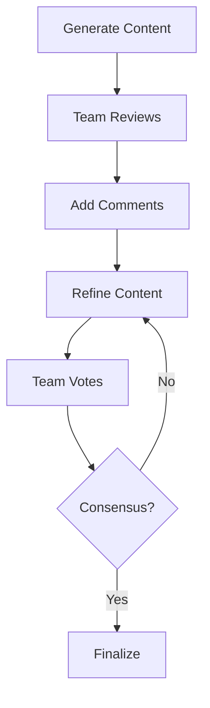

# Collaboration

Collaborate on documents with comments and reaction features to facilitate team feedback and discussion.

## Overview

The Collaboration feature enables users to:
- Add comments to specific sections
- Like or dislike refinements
- Track user attribution and timestamps
- Build discussion threads

## Comments

### Adding Comments

**Endpoint**: `POST /projects/{id}/sections/{section_id}/comments`

**Request:**
```json
{
  "text": "We should mention the impact on small businesses here",
  "user_id": "user_xyz789"
}
```

**Response:**
```json
{
  "id": "cmt_abc123",
  "user_id": "user_xyz789",
  "text": "We should mention the impact on small businesses here",
  "created_at": "2025-11-19T03:15:00Z"
}
```

### Comment Data Model

```python
class Comment(BaseModel):
    id: str                    # Unique comment ID
    user_id: str               # Commenter's user ID
    text: str                  # Comment content
    created_at: datetime       # Timestamp
```

### Frontend Implementation

```typescript
const CommentSection = ({ projectId, sectionId, comments }: Props) => {
  const [newComment, setNewComment] = useState('');
  
  const addComment = async () => {
    const token = await auth.currentUser?.getIdToken();
    const userId = auth.currentUser?.uid;
    
    const response = await axios.post(
      `${API_URL}/projects/${projectId}/sections/${sectionId}/comments`,
      { text: newComment, user_id: userId },
      { headers: { Authorization: `Bearer ${token}` } }
    );
    
    setComments([...comments, response.data]);
    setNewComment('');
  };
  
  return (
    <div>
      <h3>Comments</h3>
      {comments.map(comment => (
        <div key={comment.id}>
          <p><strong>User {comment.user_id}</strong></p>
          <p>{comment.text}</p>
          <small>{new Date(comment.created_at).toLocaleString()}</small>
        </div>
      ))}
      <textarea
        value={newComment}
        onChange={(e) => setNewComment(e.target.value)}
        placeholder="Add a comment..."
      />
      <button onClick={addComment}>Post Comment</button>
    </div>
  );
};
```

## Reactions (Likes/Dislikes)

### Like a Refinement

**Endpoint**: `POST /projects/{id}/sections/{sid}/refinements/{rid}/like`

**Query Parameters:**
- `user_id`: User ID performing the action

**Behavior:**
- Adds user ID to refinement's `likes` array
- Removes user ID from `dislikes` array if present
- Toggle behavior: Like again to unlike

### Dislike a Refinement

**Endpoint**: `POST /projects/{id}/sections/{sid}/refinements/{rid}/dislike`

**Query Parameters:**
- `user_id`: User ID performing the action

**Behavior:**
- Adds user ID to refinement's `dislikes` array
- Removes user ID from `likes` array if present
- Toggle behavior: Dislike again to remove dislike

### Frontend Implementation

```typescript
const RefinementReactions = ({ refinement, projectId, sectionId }: Props) => {
  const userId = auth.currentUser?.uid;
  const hasLiked = refinement.likes.includes(userId);
  const hasDisliked = refinement.dislikes.includes(userId);
  
  const toggleLike = async () => {
    const token = await auth.currentUser?.getIdToken();
    await axios.post(
      `${API_URL}/projects/${projectId}/sections/${sectionId}/refinements/${refinement.id}/like?user_id=${userId}`,
      {},
      { headers: { Authorization: `Bearer ${token}` } }
    );
    // Refresh refinement data
  };
  
  const toggleDislike = async () => {
    const token = await auth.currentUser?.getIdToken();
    await axios.post(
      `${API_URL}/projects/${projectId}/sections/${sectionId}/refinements/${refinement.id}/dislike?user_id=${userId}`,
      {},
      { headers: { Authorization: `Bearer ${token}` } }
    );
    // Refresh refinement data
  };
  
  return (
    <div>
      <button onClick={toggleLike} className={hasLiked ? 'active' : ''}>
        👍 {refinement.likes.length}
      </button>
      <button onClick={toggleDislike} className={hasDisliked ? 'active' : ''}>
        👎 {refinement.dislikes.length}
      </button>
    </div>
  );
};
```

## Use Cases

### Team Review Process

1. **Content Creator** generates initial content
2. **Reviewer** adds comments with feedback
3. **Content Creator** refines based on comments
4. **Team Members** like/dislike refinements
5. **Final Version** selected based on reactions

### Feedback Collection



## Best Practices

### Comments

**Good Comments:**
- ✅ "Add a statistic about market growth"
- ✅ "This contradicts the introduction"
- ✅ "Consider mentioning regulatory changes"

**Poor Comments:**
- ❌ "Bad" (not constructive)
- ❌ "???" (unclear)
- ❌ "lol" (not helpful)

### Reactions

- **Like**: Content improvement, good changes, preferred version
- **Dislike**: Content degradation, unwanted changes, incorrect information

### Comment Etiquette

1. Be specific and constructive
2. Reference specific parts of content
3. Suggest improvements, not just criticisms
4. Keep comments professional

## Limitations

### Current Limitations

- **No threading**: Comments are flat, not nested
- **No editing**: Comments cannot be edited after posting
- **No deletion**: Comments cannot be deleted
- **No notifications**: Users not notified of new comments
- **No @mentions**: Cannot tag specific users

### Future Enhancements

- Threaded comment discussions
- Edit/delete comments
- Real-time notifications
- User mentions (@username)
- Comment resolution/archiving
- Emoji reactions beyond like/dislike

## Data Storage

### Firestore Structure

```
projects/
  {project_id}/
    outline: [
      {
        id: "s1",
        comments: [
          {
            id: "cmt_1",
            user_id: "user_123",
            text: "Great point!",
            created_at: Timestamp
          }
        ],
        refinement_history: [
          {
            id: "ref_1",
            likes: ["user_123", "user_456"],
            dislikes: ["user_789"],
            ...
          }
        ]
      }
    ]
```

## Security

### Authorization

- Users can comment on any project they have access to
- User ID verified from authentication token
- Cannot impersonate other users

### Data Validation

- Comment text: 1-1000 characters
- User ID: Must match authenticated user
- Timestamps: Server-generated, not client-provided

## Performance

### Scalability

- Comments stored in section array (Firestore document)
- Limit: ~1MB per document (hundreds of comments)
- For high-volume collaboration, consider separate collection

### Optimization

- Load comments on demand (not with project list)
- Paginate comments if many exist
- Cache user information to avoid repeated lookups

## Related Documentation

- [Content Refinement](refinement.md)
- [API: Refinement Endpoints](../api/refinement.md)
- [Architecture: Data Models](../architecture.md#data-models)

---

[← Back to Features](README.md) | [Next: Export →](export.md)
