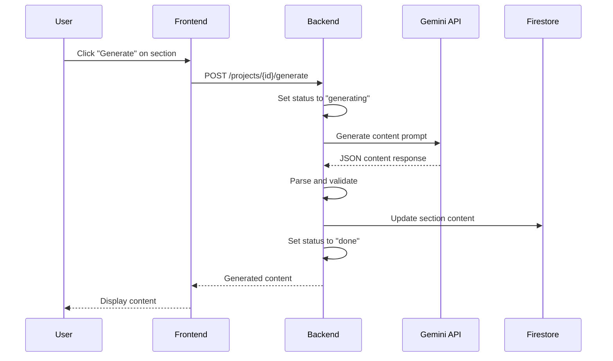

# Content Generation

Generate professional content for document sections using Google Gemini AI with automatic retry logic and status tracking.

## Overview

After creating an outline, the Content Generation feature populates each section with AI-generated content including full paragraphs and bullet point summaries.

## How It Works



## API Endpoint

**Endpoint**: `POST /projects/{id}/generate`

**Request:**
```json
{
  "section_id": "s1",
  "prompt_override": null
}
```

**Response:**
```json
{
  "id": "s1",
  "title": "Introduction",
  "word_count": 150,
  "content": "Artificial intelligence is revolutionizing healthcare...",
  "bullets": [
    "AI improves diagnostic accuracy",
    "Reduces treatment costs",
    "Enables personalized medicine"
  ],
  "status": "done",
  "version": 1
}
```

## Generation Process

### 1. Status Update
Section status changes from `"queued"` → `"generating"`

### 2. LLM Prompt
```python
prompt = f"""
SYSTEM: Return only JSON that adheres to {{ "title": "...", "text": "...", "bullets": ["..."], "word_count": N }}.
USER: Generate content for section titled "{title}" for the topic "{topic}". Tone: Professional. Max words: {word_count}. Provide short bullet summary plus full section text. Return only JSON, no commentary.
"""
```

### 3. Response Processing
- Parse JSON response
- Extract `text`, `bullets`, `word_count`
- Update section in database
- Set status to `"done"` or `"failed"`

### 4. Retry Logic
```python
max_retries = 3
for attempt in range(max_retries):
    try:
        content = llm.generate_section(title, topic, word_count)
        break
    except Exception as e:
        if attempt == max_retries - 1:
            section.status = "failed"
            raise
        time.sleep(2 ** attempt)  # Exponential backoff
```

## Status Values

| Status | Description | User Action |
|--------|-------------|-------------|
| `queued` | Waiting to be generated | Click "Generate" |
| `generating` | Currently generating | Wait (show spinner) |
| `done` | Successfully generated | View/edit content |
| `failed` | Generation failed | Retry generation |

## Content Structure

### Generated Content Fields

**`content`** (string):
- Full paragraph text
- Professional tone
- Approximately matches target word count
- Markdown formatting supported

**`bullets`** (array of strings):
- 3-5 key points
- Concise summaries
- Used for PPTX slides

**`word_count`** (integer):
- Actual word count of generated content
- May differ slightly from target

## Frontend Integration

```typescript
const GenerateButton = ({ projectId, sectionId }: Props) => {
  const [status, setStatus] = useState('queued');
  
  const generateContent = async () => {
    setStatus('generating');
    try {
      const token = await auth.currentUser?.getIdToken();
      const response = await axios.post(
        `${API_URL}/projects/${projectId}/generate`,
        { section_id: sectionId },
        { headers: { Authorization: `Bearer ${token}` } }
      );
      
      setStatus('done');
      updateSection(response.data);
    } catch (error) {
      setStatus('failed');
      console.error('Generation failed:', error);
    }
  };
  
  return (
    <button onClick={generateContent} disabled={status === 'generating'}>
      {status === 'generating' ? 'Generating...' : 'Generate Content'}
    </button>
  );
};
```

## Customization

### Custom Prompts

Use `prompt_override` to customize generation:

```json
{
  "section_id": "s1",
  "prompt_override": "Write this section in a casual, conversational tone with examples"
}
```

### Regeneration

To regenerate content:
1. Click "Generate" again
2. Previous content is replaced
3. Version number increments
4. Old content saved in refinement history (if refined)

## Best Practices

### Before Generation
- Review section titles for clarity
- Adjust word counts as needed
- Ensure outline is complete

### After Generation
- Review content for accuracy
- Check tone and style
- Verify bullet points are relevant
- Use refinement for improvements

### Batch Generation
Generate all sections at once:
```typescript
const generateAllSections = async () => {
  for (const section of outline) {
    await generateContent(projectId, section.id);
    await delay(1000); // Rate limiting
  }
};
```

## Error Handling

### Generation Failures

**Symptom**: Status changes to `"failed"`

**Common Causes:**
- API rate limits
- Invalid JSON response
- Network timeout
- Gemini API errors

**Solutions:**
1. Wait 30 seconds and retry
2. Check backend logs for details
3. Reduce word count if too large
4. Try with different section title

### Partial Content

**Symptom**: Content generated but incomplete

**Solutions:**
1. Use refinement to expand content
2. Regenerate with higher word count
3. Manually edit and expand

## Performance

### Generation Time
- **Average**: 3-5 seconds per section
- **Factors**: Word count, API load, network speed

### Optimization Tips
- Generate sections sequentially to avoid rate limits
- Use reasonable word counts (50-400)
- Implement progress indicators for user feedback

## Limitations

- **Word count accuracy**: ±20% of target
- **Language**: English only (configurable)
- **Tone**: Professional by default
- **Citations**: Not included (future enhancement)

## Related Documentation

- [AI Outline Generation](ai-outline-generation.md)
- [Content Refinement](refinement.md)
- [API: Generation Endpoint](../api/generation.md)

---

[← Back to Features](README.md) | [Next: Content Refinement →](refinement.md)
