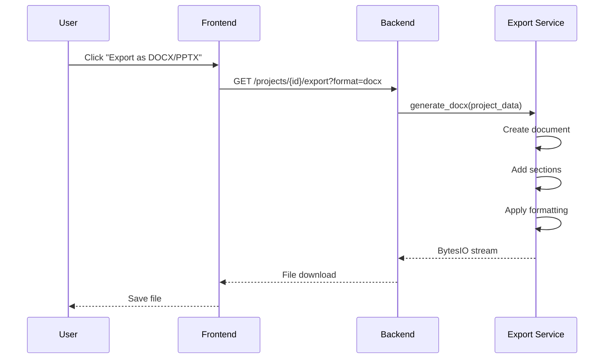

# Export

Export completed projects to professional DOCX or PPTX formats with proper formatting and styling.

## Overview

The Export feature converts your AI-generated content into downloadable Microsoft Office documents:
- **DOCX**: Word documents for reports and articles
- **PPTX**: PowerPoint presentations for slide decks

## How It Works



## API Endpoint

**Endpoint**: `GET /projects/{id}/export`

**Query Parameters:**
- `format`: `"docx"` or `"pptx"`

**Response:**
- **Content-Type**: `application/vnd.openxmlformats-officedocument.wordprocessingml.document` (DOCX)
- **Content-Type**: `application/vnd.openxmlformats-officedocument.presentationml.presentation` (PPTX)
- **Content-Disposition**: `attachment; filename="project_title.docx"`

**Example Request:**
```
GET /projects/proj_abc123/export?format=docx
Authorization: Bearer <token>
```

## DOCX Export

### Document Structure

1. **Title Page**
   - Project title (Heading 0)
   - "Generated by AI Doc Builder" subtitle
   - Page break

2. **Content Sections**
   - Section title (Heading 1)
   - Content paragraphs
   - Bullet points (if present)
   - Spacing between sections

3. **Footer**
   - "AI Doc Builder Export" text

### Implementation

```python
def generate_docx(project_data):
    document = Document()
    
    # Title Page
    document.add_heading(project_data.get('title', 'Untitled Project'), 0)
    document.add_paragraph("Generated by AI Doc Builder")
    document.add_page_break()
    
    # Sections
    for section in project_data.get('outline', []):
        document.add_heading(section.get('title', 'Untitled Section'), level=1)
        
        content = section.get('content', '')
        if content:
            # Convert markdown to plain text
            html_content = markdown2.markdown(content)
            text_content = clean_html(html_content)
            document.add_paragraph(text_content)
        
        # Add bullets
        if section.get('bullets'):
            for bullet in section.get('bullets'):
                document.add_paragraph(bullet, style='List Bullet')
        
        document.add_paragraph()  # Spacing
    
    # Footer
    section = document.sections[0]
    footer = section.footer
    footer.paragraphs[0].text = "AI Doc Builder Export"
    
    return document
```

### Markdown Conversion

Content is converted from markdown to plain text:
- **Bold** (`**text**`) → Plain text
- **Italic** (`*text*`) → Plain text
- **Links** (`[text](url)`) → Plain text
- **Headers** (`# Header`) → Plain text

> [!NOTE]
> Advanced markdown formatting (tables, code blocks) is not preserved in current implementation.

## PPTX Export

### Presentation Structure

1. **Title Slide**
   - Project title
   - "Generated by AI Doc Builder" subtitle

2. **Content Slides** (one per section)
   - Section title
   - Bullet points (max 4)
   - Full content in speaker notes

### Implementation

```python
def generate_pptx(project_data):
    prs = Presentation()
    
    # Title Slide
    title_slide_layout = prs.slide_layouts[0]
    slide = prs.slides.add_slide(title_slide_layout)
    slide.shapes.title.text = project_data.get('title', 'Untitled Project')
    slide.placeholders[1].text = "Generated by AI Doc Builder"
    
    # Content Slides
    bullet_slide_layout = prs.slide_layouts[1]
    
    for section in project_data.get('outline', []):
        slide = prs.slides.add_slide(bullet_slide_layout)
        
        # Title
        slide.shapes.title.text = section.get('title', 'Untitled')
        
        # Bullets (max 4 to fit on slide)
        body_shape = slide.placeholders[1]
        tf = body_shape.text_frame
        
        bullets = section.get('bullets', [])
        if bullets:
            for bullet in bullets[:4]:
                p = tf.add_paragraph()
                p.text = bullet
                p.level = 0
        else:
            # If no bullets, show first 100 chars of content
            content = section.get('content', '')
            if content:
                p = tf.add_paragraph()
                p.text = content[:100] + "..."
        
        # Speaker Notes (full content)
        notes_slide = slide.notes_slide
        notes_slide.notes_text_frame.text = section.get('content', '')
    
    return prs
```

### Slide Limitations

- **Bullets per slide**: Maximum 4 to ensure readability
- **Text length**: Truncated if too long
- **Images**: Not supported
- **Charts**: Not supported

## Frontend Integration

```typescript
const ExportButton = ({ projectId, format }: { projectId: string, format: 'docx' | 'pptx' }) => {
  const exportProject = async () => {
    try {
      const token = await auth.currentUser?.getIdToken();
      const response = await axios.get(
        `${API_URL}/projects/${projectId}/export?format=${format}`,
        {
          headers: { Authorization: `Bearer ${token}` },
          responseType: 'blob'
        }
      );
      
      // Create download link
      const url = window.URL.createObjectURL(new Blob([response.data]));
      const link = document.createElement('a');
      link.href = url;
      link.setAttribute('download', `project.${format}`);
      document.body.appendChild(link);
      link.click();
      link.remove();
    } catch (error) {
      console.error('Export failed:', error);
    }
  };
  
  return (
    <button onClick={exportProject}>
      Export as {format.toUpperCase()}
    </button>
  );
};
```

### Export Dropdown

```typescript
const ExportDropdown = ({ projectId }: { projectId: string }) => {
  return (
    <div className="dropdown">
      <button>Export ▼</button>
      <div className="dropdown-menu">
        <ExportButton projectId={projectId} format="docx" />
        <ExportButton projectId={projectId} format="pptx" />
      </div>
    </div>
  );
};
```

## File Naming

**Current**: Fixed filename based on format
- DOCX: `project.docx`
- PPTX: `project.pptx`

**Recommended**: Use project title
```python
filename = f"{project_data['title'].replace(' ', '_')}.{format}"
```

## Styling and Formatting

### DOCX Styling

- **Heading 0**: Title page (28pt, bold)
- **Heading 1**: Section titles (18pt, bold)
- **Body**: Normal paragraphs (11pt)
- **List Bullet**: Bullet points with indentation
- **Footer**: Small text (9pt)

### PPTX Styling

- **Title Slide**: Large title, centered
- **Content Slides**: Title + bullet layout
- **Fonts**: Default Office theme fonts
- **Colors**: Default Office theme colors

## Best Practices

### Before Export

1. **Review content**: Ensure all sections are complete
2. **Check formatting**: Preview content for markdown issues
3. **Verify bullets**: Ensure bullet points are concise
4. **Test download**: Try both formats to see which works best

### After Export

1. **Open in Office**: Verify formatting in Word/PowerPoint
2. **Apply custom styling**: Add company branding, colors
3. **Add images**: Insert relevant images and charts
4. **Final review**: Proofread and polish

## Limitations

### Current Limitations

- **No custom styling**: Uses default Office styles
- **No images**: Cannot include images from content
- **No tables**: Markdown tables not supported
- **No charts**: Data visualizations not included
- **Basic formatting**: Limited markdown support

### Future Enhancements

- Custom templates and themes
- Image embedding
- Table support
- Chart generation from data
- PDF export
- HTML export
- Custom fonts and colors

## Troubleshooting

### Export Fails

**Symptom**: Error message or no download

**Possible Causes:**
- Missing project data
- Invalid format parameter
- Network issues
- Browser blocking download

**Solutions:**
1. Check project has content
2. Verify format is "docx" or "pptx"
3. Check browser console for errors
4. Try different browser
5. Check backend logs

### Formatting Issues

**Symptom**: Content looks wrong in Office

**Solutions:**
1. Open in latest Office version
2. Check markdown syntax in content
3. Manually adjust formatting in Office
4. Report issue for future fixes

### Missing Content

**Symptom**: Sections missing in export

**Solutions:**
1. Verify sections have content in app
2. Check section status is "done"
3. Refresh project before export
4. Check backend logs for errors

## Dependencies

### Backend Libraries

```python
# requirements.txt
python-docx==0.8.11
python-pptx==0.6.21
markdown2==2.4.8
```

### Installation

```bash
pip install python-docx python-pptx markdown2
```

## Related Documentation

- [Project Management](project-management.md)
- [Content Generation](content-generation.md)
- [API: Export Endpoint](../api/export.md)

---

[← Back to Features](README.md) | [Back to Documentation Home](../README.md)
