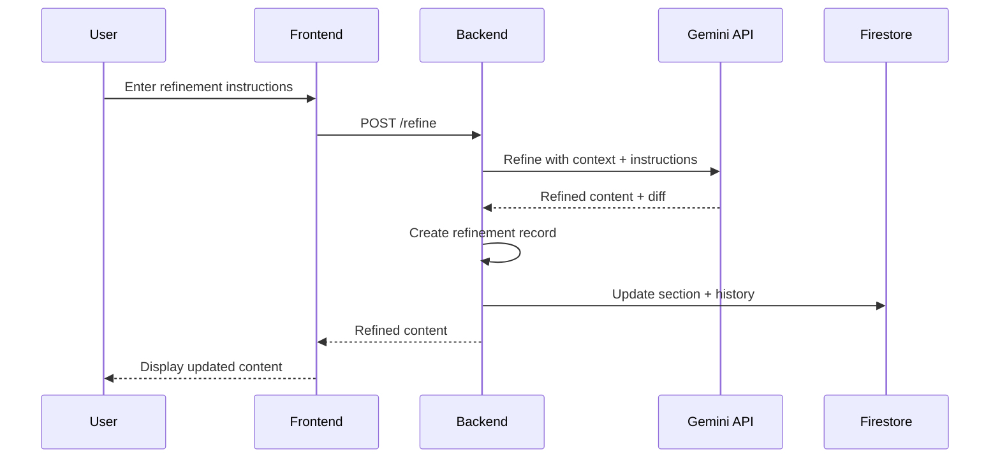

# Content Refinement

Iteratively refine generated content with AI-powered suggestions while maintaining complete version history.

## Overview

The Content Refinement feature allows users to improve generated content by providing natural language instructions. Each refinement creates a new version while preserving the history for comparison and rollback.

## How It Works



## API Endpoint

**Endpoint**: `POST /projects/{id}/sections/{section_id}/refine`

**Request:**
```json
{
  "prompt": "Make the tone more professional and add a statistic",
  "user_id": "user_xyz789"
}
```

**Response:**
```json
{
  "id": "ref_abc123",
  "user_id": "user_xyz789",
  "prompt": "Make the tone more professional and add a statistic",
  "raw_response": "...",
  "parsed_text": "Artificial intelligence has transformed healthcare, with 87% of healthcare executives...",
  "diff_summary": "Added professional tone, included 87% statistic from recent industry report",
  "created_at": "2025-11-19T03:00:00Z",
  "likes": [],
  "dislikes": []
}
```

## Refinement Process

### 1. Context Building

The system provides context to the LLM:
```python
history_str = ""
for h in refinement_history[-3:]:  # Last 3 refinements
    history_str += f"- Prompt: {h.get('prompt')}\n  Response: {h.get('parsed_text')[:50]}...\n"

context = f"""
Original Text: {current_content}
History:
{history_str}
"""
```

### 2. LLM Prompt

```python
prompt = f"""
SYSTEM: Return only JSON that adheres to {{ "text": "...", "diff_summary": "..." }}.
CONTEXT:
Original Text: {current_text}
History:
{history_str}
USER: Refine the text based on these instructions: "{instructions}". Return the new text and a brief summary of changes (diff_summary). Return only JSON.
"""
```

### 3. Response Processing

```python
response = gemini.refine_section(current_text, history, instructions)
refinement = Refinement(
    id=generate_id(),
    user_id=user_id,
    prompt=instructions,
    raw_response=response['raw'],
    parsed_text=response['text'],
    diff_summary=response['diff_summary'],
    created_at=datetime.now(),
    likes=[],
    dislikes=[]
)
section.refinement_history.append(refinement)
section.content = response['text']
section.version += 1
```

## Refinement Data Model

```python
class Refinement(BaseModel):
    id: str                        # Unique refinement ID
    user_id: str                   # User who requested
    prompt: str                    # Refinement instructions
    raw_response: Optional[str]    # Raw LLM response
    parsed_text: Optional[str]     # Refined content
    diff_summary: Optional[str]    # Summary of changes
    created_at: datetime           # Timestamp
    likes: List[str]               # User IDs who liked
    dislikes: List[str]            # User IDs who disliked
```

## Frontend Integration

### Refinement Component

```typescript
const RefinementPanel = ({ projectId, sectionId, currentContent }: Props) => {
  const [prompt, setPrompt] = useState('');
  const [loading, setLoading] = useState(false);
  
  const refineContent = async () => {
    setLoading(true);
    try {
      const token = await auth.currentUser?.getIdToken();
      const userId = auth.currentUser?.uid;
      
      const response = await axios.post(
        `${API_URL}/projects/${projectId}/sections/${sectionId}/refine`,
        { prompt, user_id: userId },
        { headers: { Authorization: `Bearer ${token}` } }
      );
      
      updateSection(response.data);
      setPrompt('');
    } catch (error) {
      console.error('Refinement failed:', error);
    } finally {
      setLoading(false);
    }
  };
  
  return (
    <div>
      <textarea
        value={prompt}
        onChange={(e) => setPrompt(e.target.value)}
        placeholder="How would you like to refine this content?"
      />
      <button onClick={refineContent} disabled={loading}>
        {loading ? 'Refining...' : 'Refine'}
      </button>
    </div>
  );
};
```

### Version History Display

```typescript
const VersionHistory = ({ refinements }: { refinements: Refinement[] }) => {
  return (
    <div>
      <h3>Refinement History</h3>
      {refinements.map((ref, index) => (
        <div key={ref.id}>
          <h4>Version {index + 2}</h4>
          <p><strong>Instruction:</strong> {ref.prompt}</p>
          <p><strong>Changes:</strong> {ref.diff_summary}</p>
          <p><strong>Content:</strong> {ref.parsed_text}</p>
          <div>
            <button onClick={() => likeRefinement(ref.id)}>
              👍 {ref.likes.length}
            </button>
            <button onClick={() => dislikeRefinement(ref.id)}>
              👎 {ref.dislikes.length}
            </button>
          </div>
        </div>
      ))}
    </div>
  );
};
```

## Refinement Examples

### Tone Adjustments

**Instruction**: "Make this more formal and academic"
**Result**: Casual language → Formal academic tone

**Instruction**: "Simplify for a general audience"
**Result**: Technical jargon → Plain language

### Content Additions

**Instruction**: "Add specific examples and statistics"
**Result**: General statements → Concrete examples with data

**Instruction**: "Include a brief historical context"
**Result**: Current focus → Historical background added

### Structure Changes

**Instruction**: "Break this into shorter paragraphs"
**Result**: Long paragraph → Multiple shorter paragraphs

**Instruction**: "Add transition sentences between ideas"
**Result**: Abrupt transitions → Smooth flow

### Length Adjustments

**Instruction**: "Expand this section with more detail"
**Result**: Brief overview → Detailed explanation

**Instruction**: "Condense to half the length"
**Result**: Verbose → Concise

## Best Practices

### Effective Refinement Instructions

**Good Instructions:**
- ✅ "Add a statistic about remote work adoption"
- ✅ "Make the tone more conversational"
- ✅ "Include an example from the tech industry"
- ✅ "Simplify the language for non-experts"

**Poor Instructions:**
- ❌ "Make it better" (too vague)
- ❌ "Fix it" (no specific guidance)
- ❌ "Change everything" (too broad)

### Iterative Refinement

1. **Start specific**: Focus on one aspect at a time
2. **Review changes**: Check diff summary before next refinement
3. **Build incrementally**: Make small improvements iteratively
4. **Use history**: Reference previous versions if needed

### Version Management

- **Keep history**: Don't delete refinement history
- **Use reactions**: Like/dislike to mark preferred versions
- **Document changes**: Diff summaries help track evolution

## Reactions (Likes/Dislikes)

### Like a Refinement

**Endpoint**: `POST /projects/{id}/sections/{sid}/refinements/{rid}/like`

**Request:**
```json
{
  "user_id": "user_xyz789"
}
```

**Behavior:**
- Adds user ID to `likes` array
- Removes from `dislikes` if present
- Toggle: Like again to unlike

### Dislike a Refinement

**Endpoint**: `POST /projects/{id}/sections/{sid}/refinements/{rid}/dislike`

**Behavior:**
- Adds user ID to `dislikes` array
- Removes from `likes` if present
- Toggle: Dislike again to remove dislike

### Frontend Implementation

```typescript
const likeRefinement = async (refinementId: string) => {
  const token = await auth.currentUser?.getIdToken();
  const userId = auth.currentUser?.uid;
  
  await axios.post(
    `${API_URL}/projects/${projectId}/sections/${sectionId}/refinements/${refinementId}/like`,
    { user_id: userId },
    { headers: { Authorization: `Bearer ${token}` } }
  );
};
```

## Rollback to Previous Version

While not directly supported, you can manually rollback:

1. View refinement history
2. Copy content from desired version
3. Create new refinement with instruction: "Use this exact text: [paste content]"

## Performance Considerations

### Response Time
- **Average**: 4-6 seconds per refinement
- **Factors**: Content length, complexity of instructions

### Rate Limiting
- Implement delays between rapid refinements
- Show loading state during processing

## Limitations

- **Context window**: Only last 3 refinements included in context
- **No automatic rollback**: Manual process required
- **Single user**: No multi-user conflict resolution
- **No branching**: Linear version history only

## Troubleshooting

### Refinement Doesn't Apply

**Cause**: Instructions too vague or conflicting
**Solution**: Be more specific and focused

### Content Gets Worse

**Cause**: Accumulation of conflicting refinements
**Solution**: Start fresh by regenerating section

### Slow Refinement

**Cause**: Long content or complex instructions
**Solution**: Refine smaller portions or simplify instructions

## Related Documentation

- [Content Generation](content-generation.md)
- [Collaboration](collaboration.md)
- [API: Refinement Endpoints](../api/refinement.md)

---

[← Back to Features](README.md) | [Next: Collaboration →](collaboration.md)
